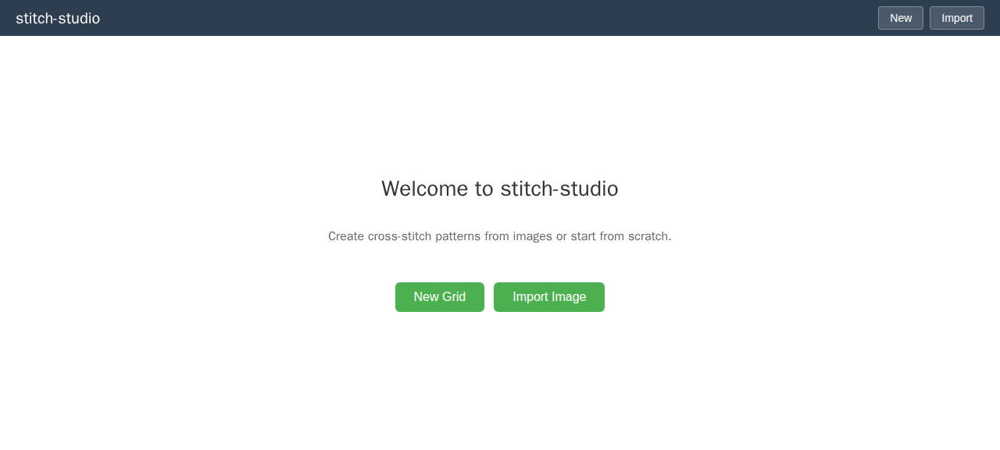
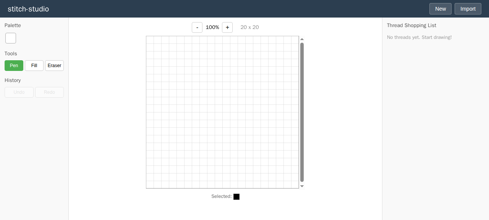

# stitch-studio

Cross-stitch pattern editor powered by Rust/WASM. Convert images into stitch patterns, edit on a grid canvas, and generate thread shopping lists with DMC color matching.





## Features

- **Image to Pattern**: Upload PNG/JPEG images and convert them to cross-stitch grid patterns using median-cut color quantization (Rust/WASM)
- **Grid Editor**: Canvas-based editor with pen, flood fill, and eraser tools. Supports zoom and undo/redo
- **DMC Thread Matching**: Automatic color-to-DMC thread number mapping with 72 color database
- **Shopping List**: Auto-calculated thread quantities (skeins) based on stitch count

## Quick Start

### Prerequisites

- [Rust](https://rustup.rs/) (with `wasm32-unknown-unknown` target)
- [wasm-pack](https://rustwasm.github.io/wasm-pack/installer/)
- [Node.js](https://nodejs.org/) >= 20

### Setup

```bash
# Clone
git clone https://github.com/akaitigo/stitch-studio.git
cd stitch-studio

# Add WASM target
rustup target add wasm32-unknown-unknown

# Build WASM module
cd wasm && wasm-pack build --target web --out-dir ../frontend/src/wasm-pkg && cd ..

# Install frontend dependencies
cd frontend && npm install && cd ..

# Run development server
cd frontend && npm run dev
```

Open http://localhost:5173 in your browser.

### Run checks

```bash
make check    # format + lint + test + build (both Rust and frontend)
```

## Architecture

```
stitch-studio/
  wasm/             Rust/WASM image processing engine
    src/lib.rs      Median-cut quantization + grid conversion
  frontend/         TypeScript/React + Vite
    src/
      components/   GridCanvas, ColorPalette, ThreadList, ImportDialog
      hooks/        useEditorState (reducer pattern)
      types/        TypeScript type definitions
      utils/        DMC thread database + color matching
  docs/
    adr/            Architecture Decision Records
```

### Key Decision

- [ADR-0001](docs/adr/0001-rust-wasm-for-image-processing.md): Rust/WASM for image processing (performance + browser-native execution)

## Tech Stack

| Layer | Technology |
|-------|-----------|
| Image Processing | Rust + wasm-pack + wasm-bindgen |
| Frontend | TypeScript + React 19 + Vite 8 |
| Grid Rendering | Canvas API |
| State Management | useReducer |
| Linting | Clippy (pedantic) + oxlint + biome |
| Testing | cargo test + vitest |
| CI/CD | GitHub Actions |

## License

MIT
